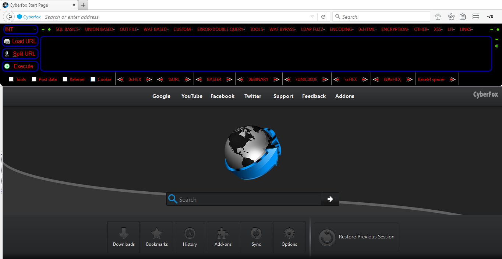

# Installing Prerences (Theme & Queries)

<b> Steps </b>
1. goto tools 
2. click Customize hackbar tools
3. click Setting
4. click import preferences (json)
5. Restart

### Dark mode

Download: [Dark.json](https://github.com/PhHitachi/HackBar/blob/master/Theme/Dark.json)

### PacMan Theme

Download: [PacMan Theme.json](https://github.com/PhHitachi/HackBar/blob/master/Theme/PacMan%20Theme.json)
